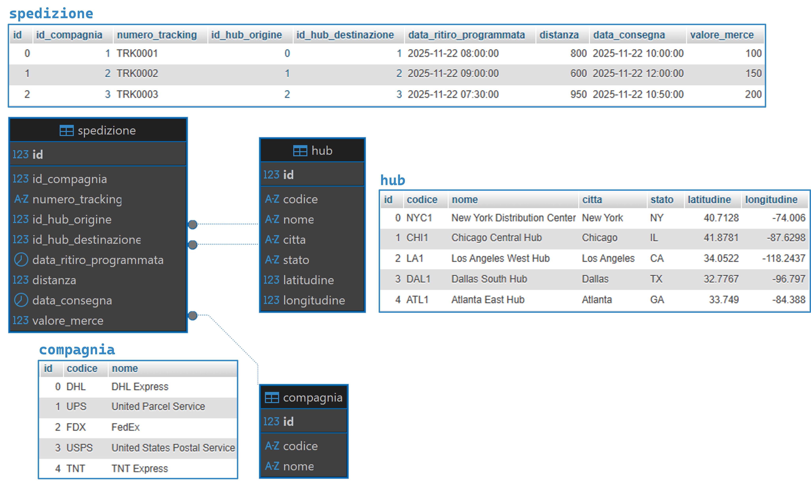
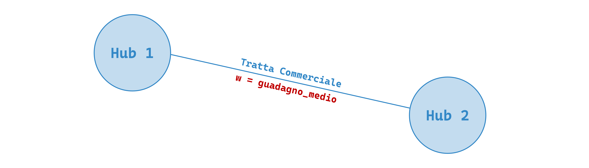
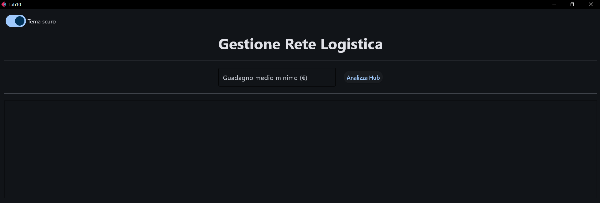
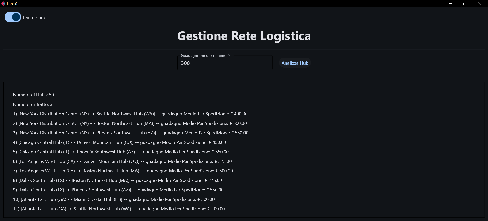

# Lab 10

#### Argomenti

- Utilizzo di Grafi
- Utilizzo della libreria [NetworkX](https://networkx.org/)

---
> **❗ ATTENZIONE:** 
>  Ricordare di effettuare il **fork** del repository principale, quindi clonare su PyCharm il **repository personale** 
> (https://github.com/my-github-username/Lab10) e non quello principale.
> 
> In caso di dubbi consultare la guida caricata nel lab02: 
> https://github.com/Programmazione-Avanzata-2025-26/Lab02/blob/main/Guida.pdf

---

##  Analisi delle tratte commerciali in una rete logistica
In questo laboratorio si richiede di sviluppare un’applicazione Python dotata di interfaccia grafica che analizzi 
le tratte commerciali tra i diversi hub logistici degli USA.
I dati provengono dal database fornito, denominato `logistics_network.sql`, che contiene le seguenti tabelle:
- `compagnia`: contiene le informazioni inerenti alle varie compagnie:
  - id
  - codice
  - nome 

- `hub`: contiene le informazioni inerenti a tutti gli hub:
  - id 
  - codice
  - nome
  - citta
  - stato
  - latitudine
  - longitudine

- `spedizione`: contiene le informazioni inerenti a tutte le spedizioni effettuate:
  - id 
  - id_compagnia
  - numero_tracking
  - id_hub_origine
  - id_hub_destinazione
  - data_ritiro_programmata
  - distanza
  - data_consegna
  - valore_merce



A partire da queste informazioni, ogni **tratta commerciale** è definita come l’insieme delle spedizioni avvenute tra 
due hub (indipendentemente dalla direzione) e ha un “valore” che corrisponde al guadagno medio generato da ciascuna 
spedizione su quella tratta, indicando quanto, in media, ogni spedizione frutti economicamente su quella tratta. 

L’applicazione permette di svolgere tre compiti principali: 
1. Inserire, tramite interfaccia grafica, un valore numerico espresso in euro, che farà da soglia (si veda il punto 
successivo); 
2. Costruire, alla pressione del pulsante “Analizza Hub”, un **grafo semplice**, **non orientato** e **pesato**, 
in cui i nodi rappresentano gli hub e gli archi rappresentano le tratte commerciali tra essi; solo le tratte con valore 
superiore o uguale alla soglia inserita dall’utente vengono incluse nel grafo; 
3. Mostrare il numero totale dei nodi del grafo, il numero degli archi e l’elenco di tutte le tratte, ciascuna 
accompagnata dal rispettivo valore. 

Per quanto riguarda la costruzione del grafo, ogni vertice deve rappresentare un hub, mentre ogni arco deve 
rappresentare una tratta esistente tra una coppia di hub. Il peso dell’arco, che corrisponde al valore della tratta, 
deve essere calcolato come il guadagno medio generato dalle spedizioni svolte in un collegamento: ciò significa sommare 
il valore della merce (campo `valore_merce` della tabella `spedizione`) di tutte le spedizioni tra due hub, 
considerando sia la direzione `A→B` sia la direzione `B→A`, e dividere questo totale per il numero complessivo delle 
spedizioni per quella coppia di hub. 

Un arco può essere inserito nel grafo solo se questo valore è almeno pari o superiore alla soglia impostata dall’utente. 
Si assuma inoltre che i valori economici registrati nel database siano espressi in euro. 

Per realizzare quanto richiesto (il **punto 2**), sono possibili due modalità alternative:
- Creare una **query SQL che aggrega** automaticamente le spedizioni nelle due direzioni e restituisce 
direttamente per ciascuna coppia di hub la somma totale del valore delle merci spedite e il numero di spedizioni, 
semplificando così la logica Python;
- Utilizzare una **query SQL più semplice**, demandando però al codice Python il compito di raggruppare le spedizioni 
nelle due direzioni e di calcolare successivamente il valore della tratta. 

L’intero progetto deve seguire il pattern MVC per separare interfaccia, logica e gestione degli eventi, 
e utilizzare il pattern DAO per l’accesso ai dati. 

##  Interfaccia
Nel progetto di base, l'interfaccia grafica (file `view.py`) è già implementata con il seguente layout:


>💡 **Esempio di Funzionamento**: L’utente inserisce un valore di 300 euro (se non viene inserito nessun valore 
> l'applicazione mostra un alert) e clicca sul pulsante “Analizza Hub” → il programma mostra il numero totale di nodi 
> del grafo, il numero di tratte valide e la lista di tratte, con affianco indicato il guadagno medio. 


## 💡 Suggerimenti Pratici
- Tutta la documentazione della libreria `NetworkX` è disponibile al seguente link: [`networkx_documentazione`](https://networkx.org/documentation/stable/#python).
- Per quanto riguarda la risoluzione del **punto 2** tramite query complessa potrebbero essere utili le funzioni 
(cliccare per accedere alla documentazione):
[`LEAST()`](https://www.w3schools.com/sql/func_mysql_least.asp) e 
[`GREATEST()`](https://www.w3schools.com/sql/func_mysql_greatest.asp).

## Materiale Fornito
Il repository del lab10 è organizzato con la struttura ad albero mostrata di seguito e contiene tutto il necessario per 
svolgere il laboratorio:

```code
Lab10/
├── database/
│   ├── __init__.py
|   ├── connector.cnf 
|   ├── DB_connect.py 
│   └── dao.py (DA MODIFICARE) 
│
├── model/ (AGGIUNGERE ULTERIORI CLASSI SE NECESSARIE) 
│   ├── __init__.py
│   ├── model.py (DA MODIFICARE) 
│   ├── compagnia.py 
│   ├── spedizione.py 
│   └── hub.py
│
├── UI/
│   ├── __init__.py
│   ├── alert.py
│   ├── controller.py (DA MODIFICARE)
│   └── view.py
│
├── logistics_network.sql (DA IMPORTARE)
└── main.py (DA ESEGUIRE)
 ```
