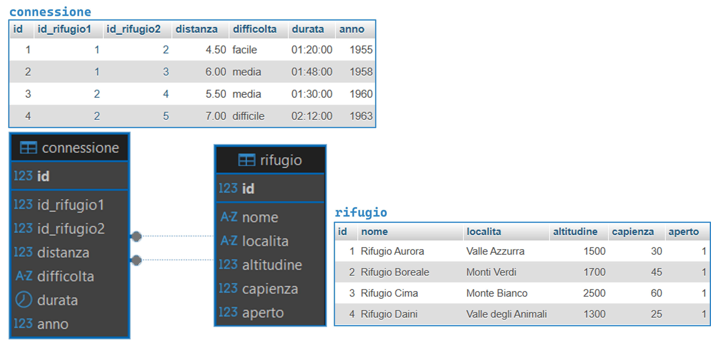
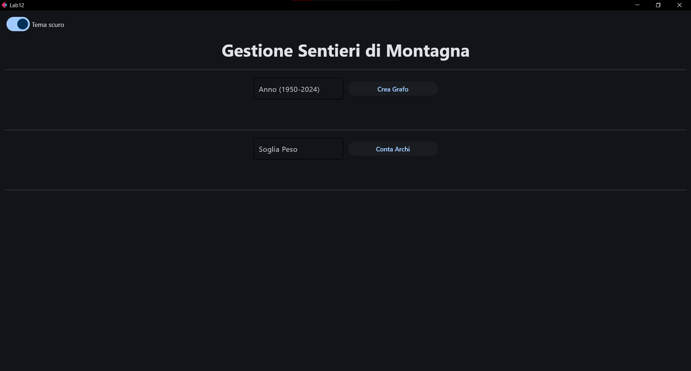
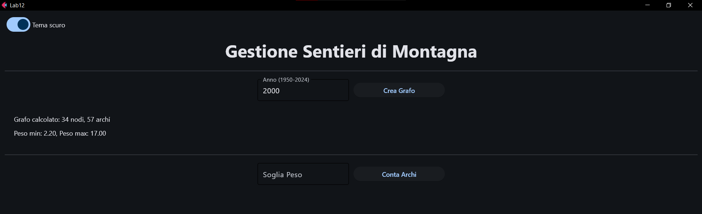
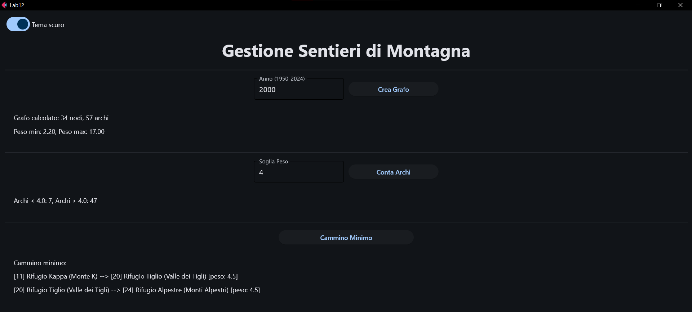

# Lab 12

#### Argomenti

- Utilizzo di Grafi
- Utilizzo della libreria [NetworkX](https://networkx.org/)
- Cammini Minimi

---
> **❗ ATTENZIONE:** 
>  Ricordare di effettuare il **fork** del repository principale, quindi clonare su PyCharm il **repository personale** 
> (https://github.com/my-github-username/Lab12) e non quello principale.
> 
> In caso di dubbi consultare la guida caricata nel lab02: 
> https://github.com/Programmazione-Avanzata-2025-26/Lab02/blob/main/Guida.pdf

---

##  Gestione Sentieri di Montagna
In questo laboratorio si richiede di sviluppare un’applicazione Python dotata di interfaccia grafica che analizzi 
le connessioni tra i rifugi di montagna nel corso degli anni. I dati provengono dal database fornito, 
denominato `mountain_paths.sql`, che contiene le seguenti tabelle:

- `rifugio`: contiene le informazioni inerenti ai rifugi:
  - id
  - nome
  - localita
  - altitudine
  - capienza
  - aperto

- `connessione`: contiene le informazioni inerenti ai vari sentieri (un sentiero è una connessione
fra due rifugi):
  - id 
  - id_rifugio1
  - id_rifugio2
  - distanza (in km)
  - difficolta (facile, media, difficile)
  - durata (hh:mm:ss)
  - anno



---
##  Interfaccia
Nel progetto di base, l'interfaccia grafica (file `view.py` e `controller.py`) è già in parte implementata con il seguente 
layout:

Tuttavia è possibile applicare modifiche se ritenuto necessario.

## ESERCIZIO 1: Costruzione del grafo pesato dei sentieri
Considerare, per questo esercizio, solo la prima parte dell'interfaccia inerente al calcolo dei sentieri. 
L’applicazione deve permettere di: 
- Inserire un anno compreso tra 1950 e 2024 e premere il pulsante “Crea Grafo”.
- Creare un grafo **non orientato** e **pesato** che rappresenti la rete escursionistica fino all’anno indicato: 
  - I nodi rappresentano i rifugi collegati da almeno un sentiero fino all’anno selezionato. 
  - Gli archi rappresentano un sentiero escursionistico tra due rifugi. 
  - Il peso di ciascun arco viene determinato combinando la distanza del sentiero (campo `distanza`) con un fattore 
  che tiene conto della difficoltà del percorso (campo `difficoltà`: facile, media, difficile): **peso = distanza x fattore_difficolta**

  
- Il valore del `fattore_difficolta` è definito come segue:

    | difficoltà | fattore_difficolta | 
    |------------|--------------------|
    | facile     | 1                  |
    | media      | 1.5                |
    | difficile  | 2                  | 

- Operazioni da implementare:
  - Visualizzare il numero di vertici ed archi del grafo, ed i valori minimo e massimo dei pesi degli archi.
  - Permettere all'utente di inserire un valore soglia (S), verificando che tale valore sia compreso nell'intervallo
  minimo-massimo calcolato al punto precedente.
  - Alla pressione del bottone "Conta Archi" stampare il numero di archi il cui peso è <S, ed il numero di archi il cui
  peso è >S.

>💡 **Esempio di Funzionamento**: L’utente inserisce l'anno 1960 e clicca sul pulsante "Crea Grafo". Se l'anno 
> inserito ha un formato non valido o non appartenente all'intervallo indicato l'applicazione mostra un alert. 
> → il programma mostra il numero di nodi e archi del grafo, e il peso minimo e massimo.

> Successivamente l'utente inserisce un valore di soglia compreso tra minimo e massimo (se viene inserito un valore 
> non compreso nell'intervallo [minimo, massimo] l'applicazione mostra un alert). → il programma mostra il numero di 
> archi con peso minore alla soglia e il numero di archi con peso maggiore alla soglia.


## ESERCIZIO 2: Ricerca Sentieri Minimi 
Partendo dal grafo ottenuto nell’Esercizio 1, implementare il pulsante “Cammino Minimo” alla cui pressione deve essere 
avviata una procedura che ricerchi il cammino più breve (somma dei pesi minima) soddisfacendo le seguenti condizioni:
  - Il percorso deve essere composto solo da archi con peso maggiore di una soglia S. 
  - Il percorso deve contenere almeno 2 archi (quindi almeno 3 nodi, per evitare soluzioni banali di un solo arco).

Al termine della ricerca, deve essere stampata la sequenza di rifugi che costituisce il cammino trovato, ordinata dal 
nodo di partenza al nodo finale. Se non esiste alcun cammino valido che rispetti questi vincoli, deve essere restituita 
una lista vuota.

### Tecniche possibili per la ricerca dei nodi raggiungibili
- Usare il supporto di **Metodi NetworkX**: [Documentazione](https://networkx.org/documentation/stable/reference/algorithms/shortest_paths)
- **Algoritmo Ricorsivo**

❗❗❗ **ATTENZIONE**: testare entrambe le tecniche. 

>💡 **Esempio di Funzionamento**: Dopo aver eseguito le istruzioni dell'Esercizio 1, l'utente clicca sul pulsante 
> "Cammino Minimo" → il programma mostra l'elenco di archi con rispettivo peso appartenenti al cammino minimo 
> individuato.


## Materiale Fornito
Il repository del Lab12 è organizzato con la struttura ad albero mostrata di seguito e contiene tutto il necessario per 
svolgere il laboratorio:

```code
Lab12/
├── database/
│   ├── __init__.py
|   ├── connector.cnf 
|   ├── DB_connect.py 
│   └── dao.py (DA MODIFICARE) 
│
├── model/ (AGGIUNGERE ULTERIORI CLASSI SE NECESSARIE) 
│   ├── __init__.py
│   └── model.py (DA MODIFICARE) 
│
├── UI/
│   ├── __init__.py
│   ├── alert.py
│   ├── controller.py (DA MODIFICARE)
│   └── view.py (DA MODIFICARE)
│
├── mountain_paths.sql (DA IMPORTARE)
└── main.py (DA ESEGUIRE)
 ```
