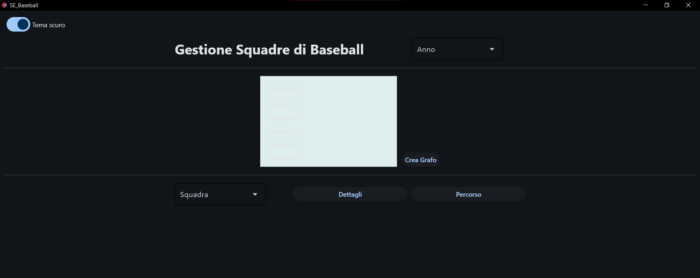
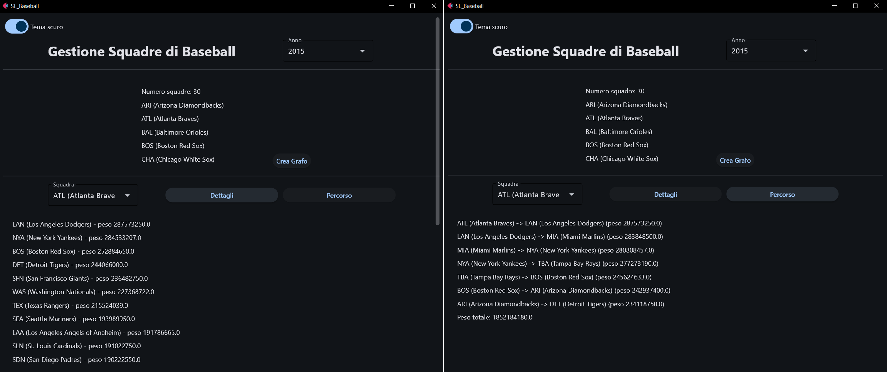
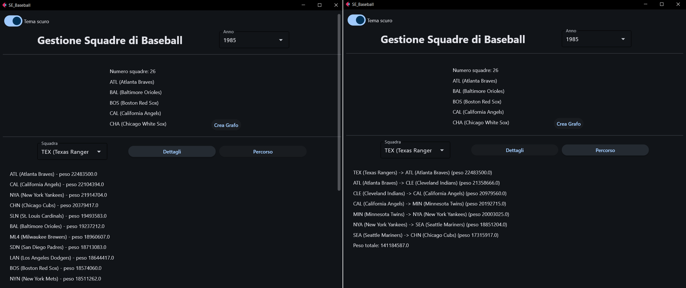

# Simulazione d'Esame (Baseball)

---
> **❗ ATTENZIONE:** 
>  Ricordare di effettuare il **fork** del repository principale, quindi clonare su PyCharm il **repository personale** 
> (https://github.com/my-github-username/SE_Baseball) e non quello principale.
> 
> In caso di dubbi consultare la guida caricata nel lab02: 
> https://github.com/Programmazione-Avanzata-2025-26/Lab02/blob/main/Guida.pdf

---
**DURATA DELLA PROVA**: 2 h

---

Si consideri il database `lahmansbaseballdb_small` che contiene le seguenti tabelle:
- `team`: contiene tutte le squadre iscritte al campionato per ogni anno dal 1871 al 2019;
- `player`: contiene tutti i dettagli dei giocatori professionisti;
- `appearance`: contiene le informazioni sulle partecipazioni dei giocatori al campionato con una (o più) squadre 
(si noti che non è escluso a priori che un giocatore possa aver cambiato squadra durante l’anno di campionato);
- `salary`: contiene gli ingaggi di un singolo giocatore per uno specifico anno;
- `manager`: contiene le informazioni sui manager;
- `park`: contiene le informazioni sui parchi.


Si intende costruire un’applicazione FLET che permetta di svolgere le seguenti funzioni: 

## PUNTO 1
1. Permettere all’utente di selezionare da un apposito menu a tendina il valore di un anno di campionato, tra quelli 
disponibili nel database (colonna `year` della tabella `team`), a partire dal 1980 (gli anni precedenti non 
devono comparire). 
2. Non appena viene selezionato l’anno (intercettando l’evento `on_change`), si dovrà stampare il numero di squadre 
(tabella `team`) che ha giocato in tale anno, e l’elenco delle rispettive sigle, nella prima area di testo 
(`txt_out_squadre`). Nello stesso momento occorre aggiornare il contenuto del menu a tendina “Squadre”.
3. Alla pressione del pulsante “Crea Grafo”, occorre creare un grafo completo, non ordinato e pesato, in cui i vertici
siano le squadre di cui al punto precedente, e gli archi colleghino tutte le coppie distinte di squadre.
4. Il peso di ciascun arco del grafo deve corrispondere alla somma dei salari dei giocatori delle due squadre nell’anno 
considerato. **Nota**: potrebbe essere conveniente calcolare e memorizzare la somma dei salari di ciascuna squadra.
5. Permettere all’utente di selezionare, attraverso un secondo menu a tendina, una delle squadre esistenti nel grafo, 
ed alla pressione del pulsante “Dettagli” stampare per tale squadra l’elenco delle squadre adiacenti, ed il peso degli 
archi corrispondenti, in ordine decrescente di peso. Tali informazioni dovranno essere stampate nella seconda area 
di testo (`txt_risultato`).

Esempio interfaccia grafica: 


## PUNTO 2
Partendo dal grafo calcolato nel punto precedente, alla pressione del pulsante “Percorso” si implementi una procedura 
ricorsiva che calcoli un percorso di peso massimo avente le seguenti caratteristiche:
- Il punto di partenza è il vertice selezionato al punto 1.5;
- Ogni vertice può comparire una sola volta;
- Il peso degli archi nel percorso deve essere strettamente decrescente.
- Per limitare i tempi di esecuzione, la procedura ricorsiva deve considerare solo i primi `K` archi adiacenti ordinati 
per peso decrescente (ad esempio `K=3`), cioè ogni vertice esplora al massimo i `K` vicini più pesanti che rispettano 
il vincolo decrescente.
- Al termine della ricerca, si visualizzi, nella seconda area di testo (`txt_risultato`), l’elenco dei vertici ed i pesi 
degli archi incontrati, oltre al peso totale del percorso ottimo.

Nella realizzazione del codice, si lavori a partire dalle classi e dal database contenuti nel progetto di base. 
È ovviamente permesso aggiungere o modificare classi e metodi. 

Tutti i possibili errori di immissione, validazione dati, accesso al database, ed algoritmici devono essere gestiti, 
non sono ammesse eccezioni generate dal programma.

-----

#### ESEMPI DI RISULTATI PER CONTROLLARE LA PROPRIA SOLUZIONE: 



-----
## Materiale Fornito
Il repository SE_Baseball è organizzato con la struttura ad albero mostrata di seguito e contiene tutto il necessario 
per svolgere l'esame:

```code
SE_Baseball/
├── database/
│   ├── __init__.py
|   ├── connector.cnf 
|   ├── DB_connect.py 
│   └── dao.py (DA MODIFICARE) 
│
├── model/ (AGGIUNGERE ULTERIORI CLASSI SE NECESSARIE) 
│   ├── __init__.py
│   └── model.py (DA MODIFICARE) 
│
├── UI/
│   ├── __init__.py
│   ├── alert.py
│   ├── controller.py (DA MODIFICARE)
│   └── view.py (DA MODIFICARE)
│
├── requirements.txt
├── lahmansbaseballdb_small.sql (DA IMPORTARE)
└── main.py (DA ESEGUIRE)
 ```
