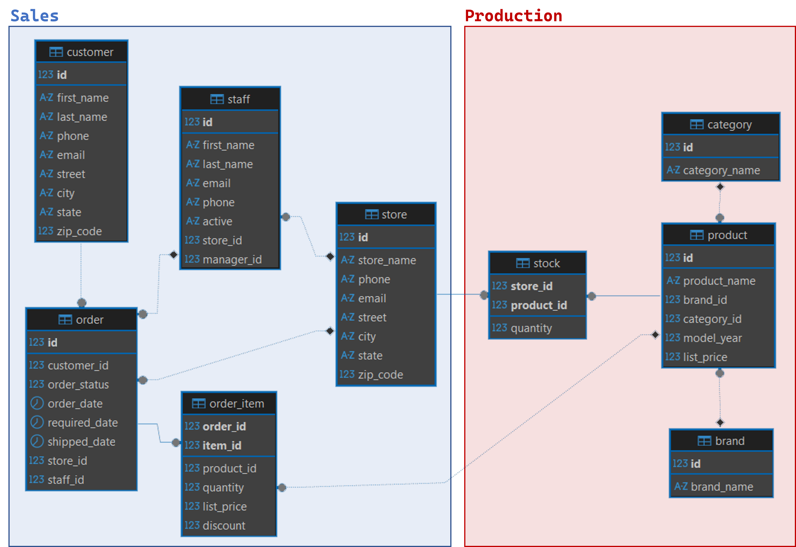
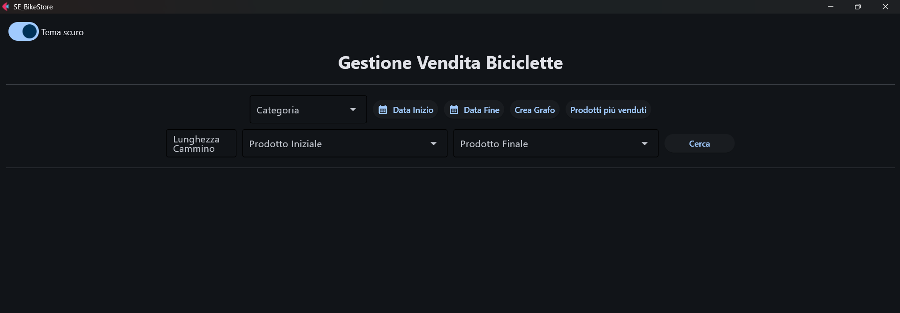
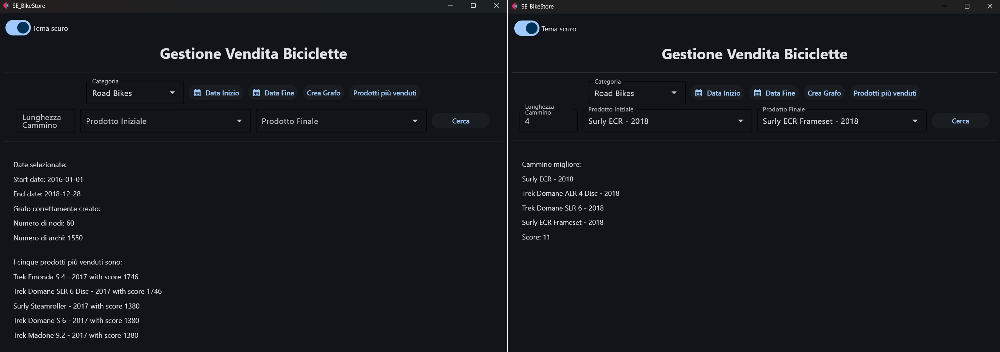
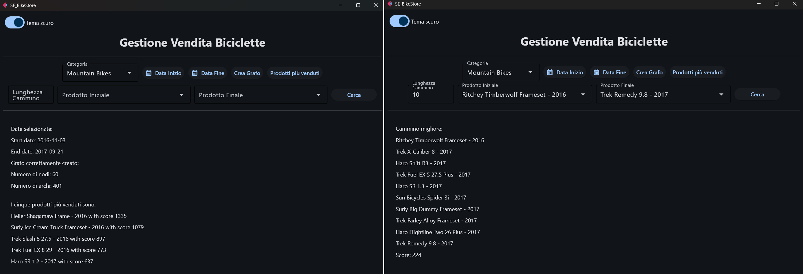

# Simulazione d'Esame (BikeStore)

---
> **❗ ATTENZIONE:** 
>  Ricordare di effettuare il **fork** del repository principale, quindi clonare su PyCharm il **repository personale** 
> (https://github.com/my-github-username/SE_BikeStore) e non quello principale.
> 
> In caso di dubbi consultare la guida caricata nel lab02: 
> https://github.com/Programmazione-Avanzata-2025-26/Lab02/blob/main/Guida.pdf

---
**DURATA DELLA PROVA**: 2 h

---

Si consideri il database `bike_store_full`, contenente informazioni sui prodotti, gli acquirenti, gli ordini, gli store,
tipologie di biciclette, estratto dai dati pubblicati sul sito 
https://www.kaggle.com/datasets/dillonmyrick/bike-store-sample-database e contenente le seguenti tabelle:
- `brand`: contiene le informazioni riguardanti i brand;
- `category`: contiene le informazioni riguardanti le categorie di biciclette;
- `customer`: contiene le informazioni riguardanti gli acquirenti;
- `store`: contiene le informazioni riguardanti i negozi;
- `staff`: contiene le informazioni riguardanti lo staff;
- `order`: contiene le informazioni riguardanti gli ordini;
- `product`: contiene le informazioni riguardanti i vari prodotti;
- `order_item`: contiene le informazioni sulle vendite;
- `stock`: contiene le informazioni sui vari stock.



Si intende costruire un’applicazione FLET che permetta di svolgere le seguenti funzioni:

## PUNTO 1
1. L’utente seleziona da un menù a tendina una categoria di prodotti fra quelle presenti nel database (tabella 
`category`). Due `DatePickers` sono invece utilizzati per indicare un range temporale di interesse. I menù dovranno 
essere riempiti interrogando il database per ottenere gli estremi di date in cui sono stati venduti dei prodotti 
(già fatto ✅) e le categorie dei prodotti (TODO 📝).
2. Premendo il pulsante "Crea Grafo", l’applicazione dovrà costruire un grafo orientato e pesato, così costituito:
   - I nodi sono costituiti da tutti i prodotti della categoria selezionata dall’utente;
   - Due nodi sono connessi da un arco se e solo se entrambi i prodotti sono stati venduti almeno una volta nel range 
   selezionato (estremi inclusi). L’arco è uscente dal nodo con numero di vendite maggiore ed entrante nel nodo con 
   numero di vendite minore. In caso di parità di numero di vendite, si inseriscano entrambi gli archi.
   
     > **💡 Suggerimento:** per confrontare date in un range in SQL, è possibile usare l’operatore `BETWEEN`. 
   Nell’esempio seguente, la query:
     > ```sql
     > SELECT *
     > FROM studente
     > WHERE eta BETWEEN 20 AND 25;
     > ```
     > è equivalente alla query:
     > ```sql
     > SELECT *
     > FROM studente
     > WHERE eta >= 20 AND eta <= 25;
     > ```
     Nel caso in cui un nodo non sia stato venduto nel range selezionato, quel nodo deve rimanere isolato. Il peso 
     dell’arco è pari alla somma delle vendite dei prodotti nel range considerato (numero di vendite distinte, non si 
     considerino eventuali vendite di più di un pezzo).

3. Costruito il grafo, l’applicazione deve visualizzare nella GUI il numero di nodi e di archi presenti nel grafo. 
Alla pressione del tasto "Prodotti più venduti", il programma dovrà visualizzare i 5 prodotti più venduti, ovvero i 
nodi la cui somma dei pesi degli archi uscenti meno la somma dei pesi degli archi entranti è massima.

Esempio interfaccia grafica: 


## PUNTO 2
Partendo dal grafo calcolato nel punto precedente, si inseriscano nei dropdown “Prodotto Iniziale” ed “Prodotto Finale” 
tutti i nodi presenti nel grafo, e si implementi un algoritmo ricorsivo che identifichi un cammino ottimo tale per cui:
- Il cammino parta dal nodo identificato come “Prodotto Iniziale” e termini nel nodo identificato come “Prodotto Finale”;
- La lunghezza del cammino sia pari a `L`, valore numerico fornito dall’utente nel campo “Lunghezza Cammino”;
- Il cammino attraversi gli archi rispettando i versi;
- Un nodo non può essere attraversato più volte;
- La somma dei pesi degli archi deve essere massima.
Identificato il percorso, si visualizzino nella GUI la sequenza di nodi e la somma dei pesi degli archi.

Nella realizzazione del codice, si lavori a partire dalle classi e dal database contenuti nel progetto di base. 
È ovviamente permesso aggiungere o modificare classi e metodi. 

Tutti i possibili errori di immissione, validazione dati, accesso al database, ed algoritmici devono essere gestiti, 
non sono ammesse eccezioni generate dal programma.

-----

#### ESEMPI DI RISULTATI PER CONTROLLARE LA PROPRIA SOLUZIONE: 



-----
## Materiale Fornito
Il repository SE_BikeStore è organizzato con la struttura ad albero mostrata di seguito e contiene tutto il necessario 
per svolgere l'esame:

```code
SE_BikeStore/
├── database/
│   ├── __init__.py
|   ├── connector.cnf 
|   ├── DB_connect.py 
│   └── dao.py (DA MODIFICARE) 
│
├── model/ (AGGIUNGERE ULTERIORI CLASSI SE NECESSARIE) 
│   ├── __init__.py
│   └── model.py (DA MODIFICARE) 
│
├── UI/
│   ├── __init__.py
│   ├── alert.py
│   ├── controller.py (DA MODIFICARE)
│   └── view.py (DA MODIFICARE)
│
├── requirements.txt
├── bike_store_full.sql (DA IMPORTARE)
└── main.py (DA ESEGUIRE)
 ```
