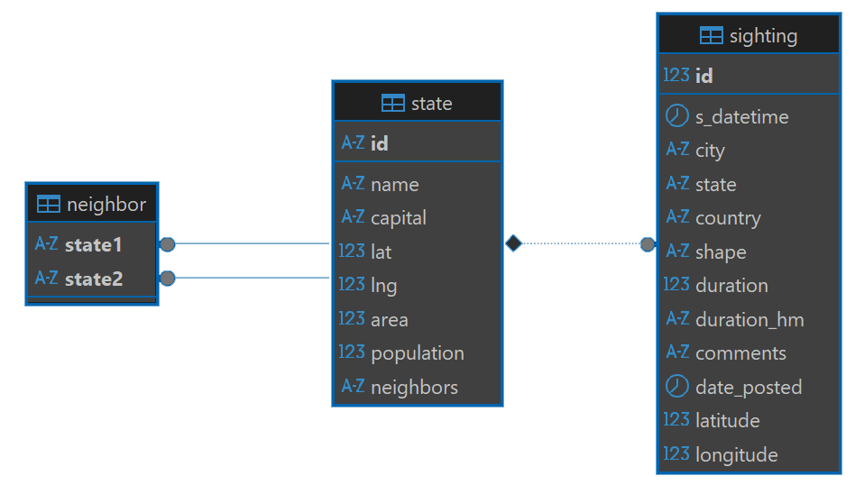
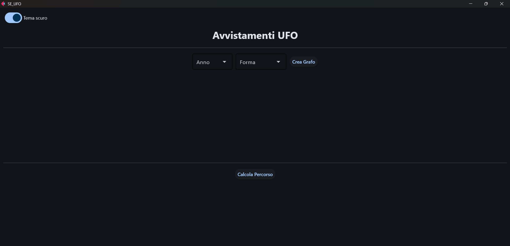
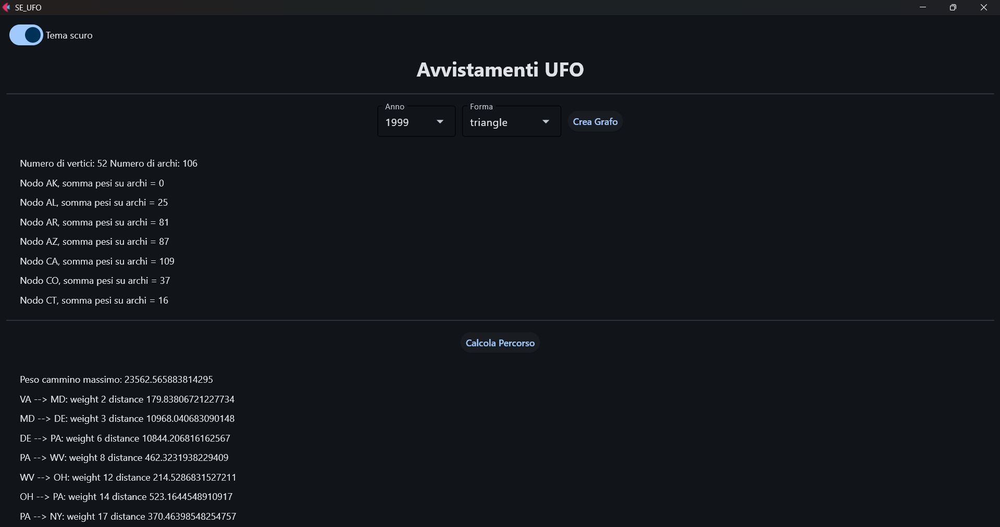
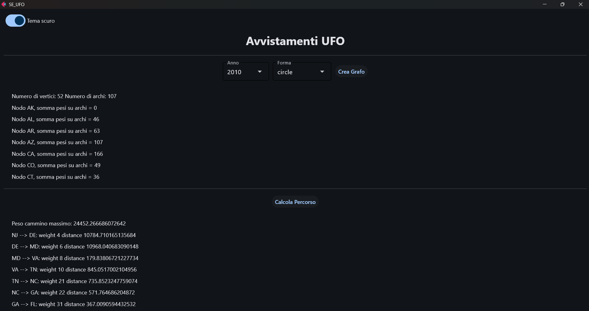

# Simulazione d'Esame (UFO Sightings)

---
> **❗ ATTENZIONE:**  
> Ricordare di effettuare il **fork** del repository principale, quindi clonare su PyCharm il **repository personale**  
> (https://github.com/my-github-username/SE_UFO) e non quello principale.  
> In caso di dubbi consultare la guida caricata nel lab02:  
> https://github.com/Programmazione-Avanzata-2025-26/Lab02/blob/main/Guida.pdf

---
**DURATA DELLA PROVA**: 2 h

---

Si consideri il database `ufo_sightings`, contenente informazioni su oltre 80.000 avvistamenti di presunti UFO tra 
il 1910 e il 2014. Il database, modificato a partire dai dati presenti su Kaggle 
(https://www.kaggle.com/NUFORC/ufo-sightings), contiene solamente i dati relativi agli avvistamenti negli USA
e contenente le seguenti tabelle:
- `state`: contiene le informazioni riguardanti gli stati degli USA;
- `sighting`: contiene le informazioni riguardanti gli avvistamenti;
- `neighbor`: contiene i collegamenti tra uno stato e l'altro.



Si intende costruire un’applicazione FLET che permetta di svolgere le seguenti funzioni:

## PUNTO 1

1. Permettere all’utente di selezionare dal menu a tendina "Anno" un anno tra tutti quelli presenti nel database 
(colonna `s_datetime` della tabella `sighting`).  
   - Verifica: il menu deve contenere tutti gli anni dal 1910 al 2014 inclusi.  
2. Popolare un secondo menu a tendina "Forma" con tutte le forme presenti nella colonna `shape` della tabella 
`sighting`, relative agli avvistamenti nell’anno selezionato.  
3. Alla pressione del pulsante "Crea Grafo", creare un grafo semplice, pesato e non orientato, in cui:  
   - i **vertici** rappresentano tutti gli stati presenti nella tabella `state`;  
   - un **arco** collega due stati solo se confinanti (come indicato nella tabella `neighbor`);  
   - il **peso dell’arco** corrisponde al numero di avvistamenti dello **stesso anno** e della **stessa forma** selezionata, che coinvolgono i due stati connessi.  
4. Visualizzare nella GUI, per ogni stato, la somma dei pesi degli archi adiacenti.

Esempio interfaccia grafica: 


## PUNTO 2
Dato il grafo costruito al punto precedente, si vuole identificare un percorso semplice che massimizza la distanza 
tra stati con archi di peso sempre crescente.

1. Alla pressione del pulsante "Calcola Percorso", avviare una procedura ricorsiva per calcolare il percorso ottimo.  
2. Visualizzare nella GUI:  
   - il percorso trovato (elenco di stati);  
   - il peso di ciascun arco;  
   - la distanza geodesica tra i due stati connessi. 

> **💡 Suggerimento:**  
> Per il calcolo della distanza geodesica tra stati (necessaria al **PUNTO 2**), utilizzare i campi `lat` e `lng` 
> della tabella `state`.  
> Ad esempio, è possibile importare `distance` da geopy:  
> ```python
> from geopy import distance
> d = distance.geodesic((lat1, lng1), (lat2, lng2)).km
> ```

Nella realizzazione del codice, si lavori a partire dalle classi e dal database contenuti nel progetto di base. 
È ovviamente permesso aggiungere o modificare classi e metodi. 

Tutti i possibili errori di immissione, validazione dati, accesso al database, ed algoritmici devono essere gestiti, 
non sono ammesse eccezioni generate dal programma.

---

#### ESEMPI DI RISULTATI PER CONTROLLARE LA PROPRIA SOLUZIONE: 



---

## Materiale Fornito
Il repository SE_UFO è organizzato con la struttura ad albero mostrata di seguito e contiene tutto il necessario 
per svolgere l'esame:

```text
SE_UFO/
├── database/
│   ├── __init__.py
│   ├── connector.cnf 
│   ├── DB_connect.py 
│   └── dao.py (DA MODIFICARE) 
│
├── model/ (AGGIUNGERE ULTERIORI CLASSI SE NECESSARIE) 
│   ├── __init__.py
│   └── model.py (DA MODIFICARE) 
│
├── UI/
│   ├── __init__.py
│   ├── alert.py
│   ├── controller.py (DA MODIFICARE)
│   └── view.py
│
├── requirements.txt
├── ufo_sightings.sql (DA IMPORTARE)
└── main.py (DA ESEGUIRE)
