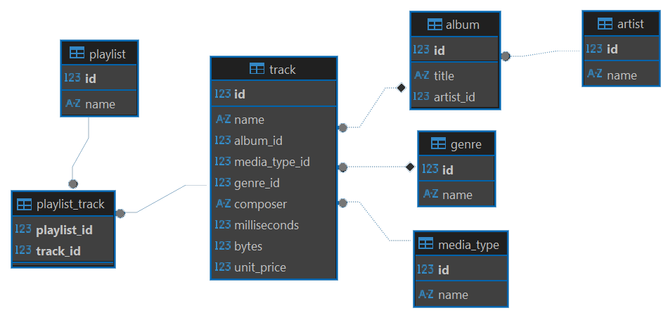
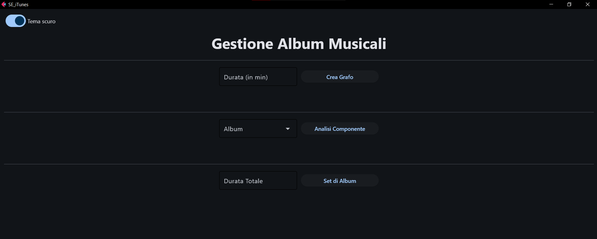
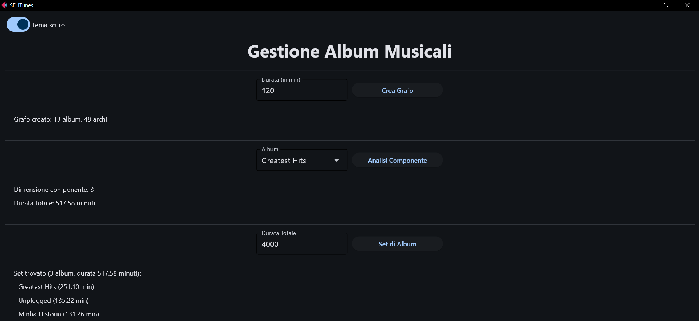
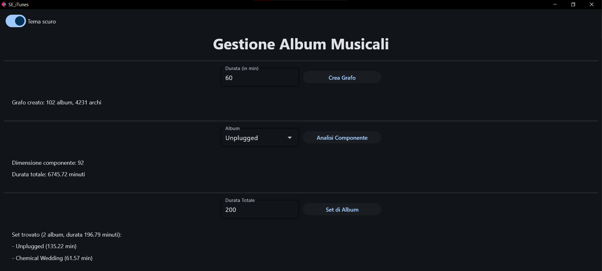

# Simulazione d'Esame (iTunes)

---
> **❗ ATTENZIONE:** 
>  Ricordare di effettuare il **fork** del repository principale, quindi clonare su PyCharm il **repository personale** 
> (https://github.com/my-github-username/SE_iTunes) e non quello principale.
> 
> In caso di dubbi consultare la guida caricata nel lab02: 
> https://github.com/Programmazione-Avanzata-2025-26/Lab02/blob/main/Guida.pdf

---
**DURATA DELLA PROVA**: 2 h

---
Si consideri il database `iTunes.sql`, tratto dalla piattaforma iTunes di Apple. Il database è stato estratto a partire 
dai dati di un utente reale e contiene le seguenti tabelle:
- `artist`: contiene le informazioni su artisti:
  - **id**
  - name
- `album`: contiene le informazioni sugli album musicali:
  - **id**
  - title
  - artist_id
- `track`: contiene le informazioni sulle canzoni:
  - **id**
  - name
  - album_id
  - media_type_id
  - genre_id
  - composer
  - milliseconds
  - bytes
  - unit_price
- `playlist`: contiene le informazioni sulle playlist:
  - **id**
  - name
- `genre`: contiene le informazioni sui generi musicali:
  - **id**
  - name
- `media_type`: contiene le informazioni sulla tipologia di media:
  - **id**
  - name
- `playlist_track`: contiene tutte le relazioni tra le playlist e le canzoni (N:N)
  - **playlist_id**
  - **track_id**



Si intende costruire un’applicazione FLET che permetta di svolgere le seguenti funzioni: 
## PUNTO 1
1. Permettere all’utente di inserire, nell’apposito campo di testo, una durata "d" espressa in minuti. 
2. Alla pressione del pulsante “Crea Grafo”, si crei un grafo semplice, non orientato e non pesato, i cui vertici sono
tutti gli album musicali (tabella `album`) la cui durata (intesa come somma delle durate dei brani ad esso appartenenti)
sia superiore a "d". 
3. Due album "a1" e "a2" sono collegati tra loro se almeno una canzone di "a1" e una canzone di "a2" sono state 
inserite da un utente all’interno di una stessa playlist (tabella `playlist_track`). 
4. Permettere all’utente di selezionare, dall’apposito menu a tendina, un album "a1" tra quelli presenti nel grafo. 
Alla pressione del pulsante “Analisi Componente”, si visualizzino nella GUI:
   - La dimensione della componente connessa a cui appartiene "a1";
   - La durata complessiva (in minuti) di tutti gli album appartenenti alla componente connessa di "a1".

Esempio interfaccia grafica: 


## PUNTO 2
Permettere all’utente di inserire una durata complessiva "dTOT" (nel campo "Durata Totale"), espressa in minuti. Alla pressione 
del pulsante “Set di Album”, utilizzare un algoritmo ricorsivo per estrarre un set di album dal grafo che abbia le 
seguenti caratteristiche:
- Includa "a1";
- Includa solo album appartenenti alla stessa componente connessa di "a1";
- Includa il maggior numero possibile di album;
- Abbia una durata complessiva, definita come la somma della durata degli album in esso contenuti, non superiore "dTOT".

Nella realizzazione del codice, si lavori a partire dalle classi e dal database contenuti nel progetto di base. 
È ovviamente permesso aggiungere o modificare classi e metodi. 

Tutti i possibili errori di immissione, validazione dati, accesso al database, ed algoritmici devono essere gestiti, 
non sono ammesse eccezioni generate dal programma.

-----

#### ESEMPI DI RISULTATI PER CONTROLLARE LA PROPRIA SOLUZIONE: 




-----
## Materiale Fornito
Il repository SE_iTunes è organizzato con la struttura ad albero mostrata di seguito e contiene tutto il necessario 
per svolgere l'esame:

```code
SE_iTunes/
├── database/
│   ├── __init__.py
|   ├── connector.cnf 
|   ├── DB_connect.py 
│   └── dao.py (DA MODIFICARE) 
│
├── model/ (AGGIUNGERE ULTERIORI CLASSI SE NECESSARIE) 
│   ├── __init__.py
│   └── model.py (DA MODIFICARE) 
│
├── UI/
│   ├── __init__.py
│   ├── alert.py
│   ├── controller.py (DA MODIFICARE)
│   └── view.py
│
├── requirements.txt
├── iTunes.sql (DA IMPORTARE)
└── main.py (DA ESEGUIRE)
 ```
